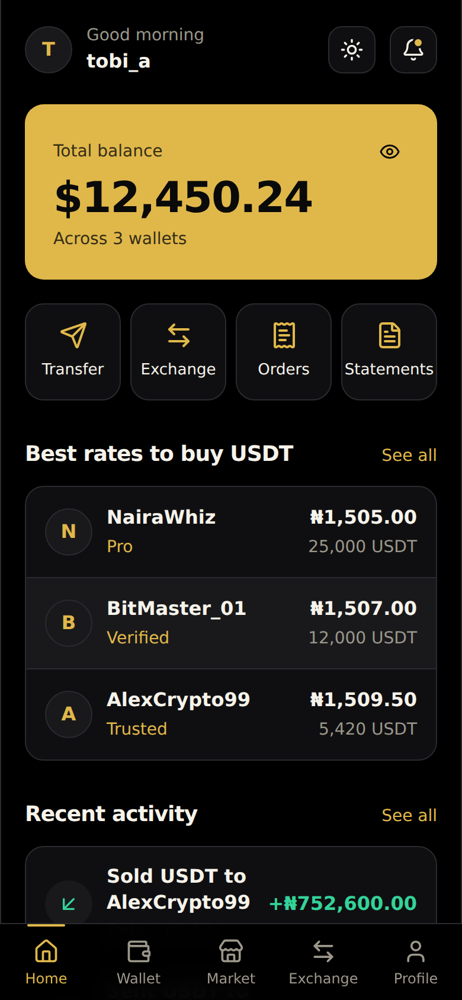
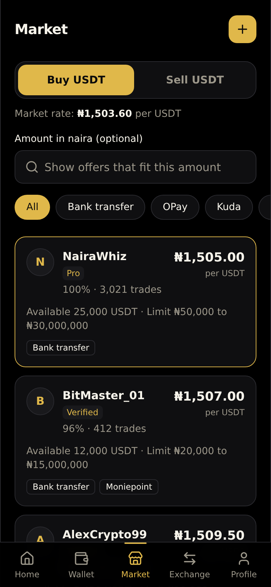
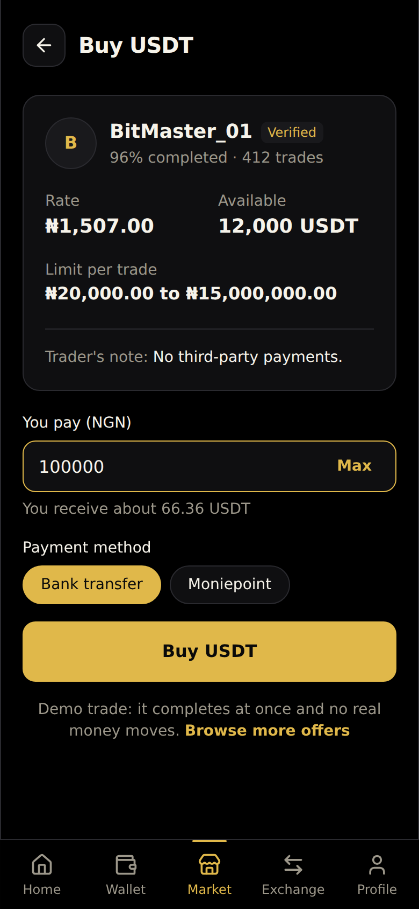
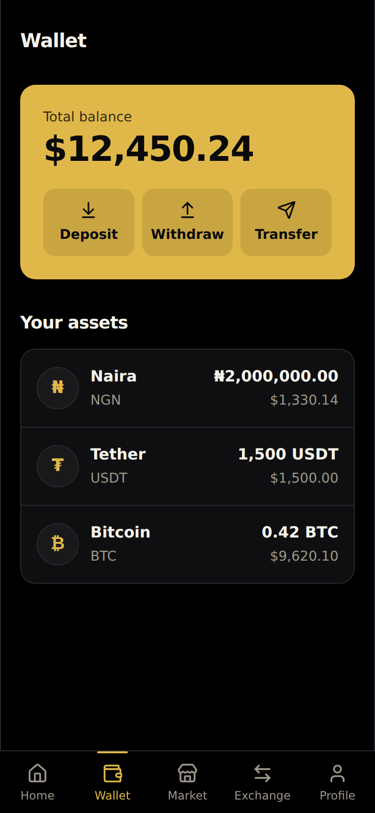
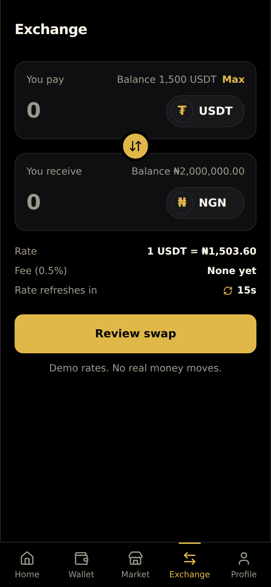
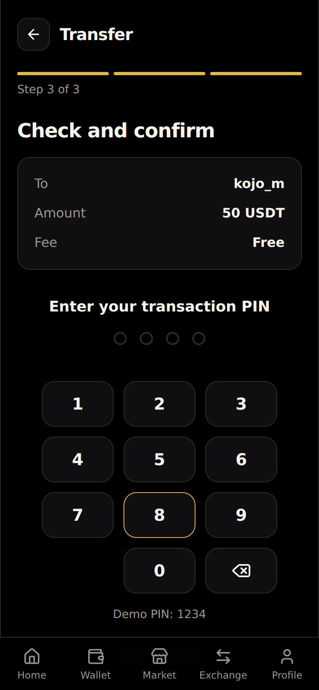
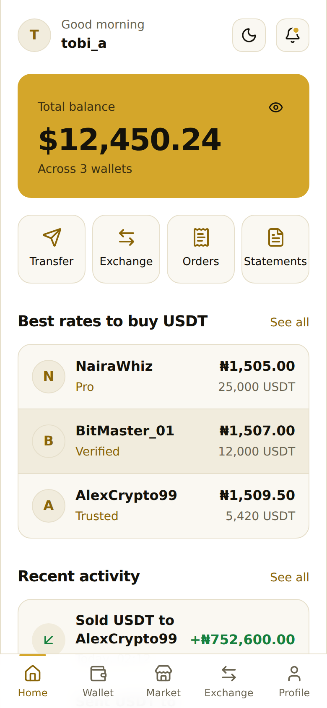
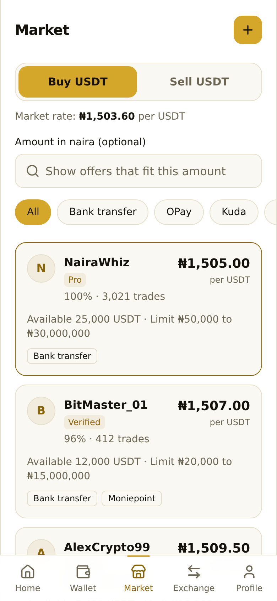

# Pexora

A peer-to-peer exchange app where people trade naira and USDT directly with each other.
Built as a frontend portfolio project with React, TypeScript and Tailwind CSS.

**It is a demo.** No real money moves, there is no server, and everything you do is saved in your own browser.

<p>
  
  
  
  
</p>
<p>
  
  
  
  
</p>

Two colour modes: **black and gold** and **white and gold**. Switch any time in Preferences.

## What you can do

| Area | What works |
| --- | --- |
| **Account** | Sign up and log in with checks on every field, a one-tap demo account, and a session that survives a refresh. |
| **Home** | Total balance (hide it, or show it in dollars or naira), quick actions, best rates, recent activity. |
| **Wallet** | Balances for naira, USDT and Bitcoin. Deposit with a QR code and copyable address, or by bank transfer. Withdraw with fee, limits, review and PIN. |
| **Transfer** | Send money to another user in three steps: recipient, amount, confirm with PIN. Gets a receipt with a reference. |
| **Market** | Buy and sell USDT. Filter by payment method or amount. Open an offer, trade with a PIN, post your own offer, close it. |
| **Exchange** | Swap between assets with demo rates that refresh every 15 seconds. The quote is locked when you review it. |
| **Orders** | Trade history with receipts, plus an activity feed with money in and money out filters. |
| **Statements** | Pick a period and download a **PDF** or **CSV** statement, made in the browser. |
| **Profile** | Change nickname, and a 3-step identity check (details, ID, selfie) with format checks and photo previews. |
| **Security** | Change the transaction PIN and password, two-step switch, freeze and unfreeze the account (email code and PIN). |
| **Notifications** | An inbox with unread dots, plus alert preferences. |
| **Help** | Searchable help center, contact form, About, Terms and Privacy. |

## Built with

- [React 19](https://react.dev) and [TypeScript](https://www.typescriptlang.org)
- [Vite](https://vite.dev) for the dev server and build
- [Tailwind CSS v4](https://tailwindcss.com) with a theme made from CSS variables
- [React Router](https://reactrouter.com)
- [lucide-react](https://lucide.dev) for icons
- [qrcode.react](https://github.com/zpao/qrcode.react) and [jsPDF](https://github.com/parallax/jsPDF) (the PDF tool loads only when you download a statement)

## Run it

You need [Node.js](https://nodejs.org) 20.19 or newer (or 22.12 or newer).

```bash
npm install
npm run dev
```

Then open the address Vite prints, usually http://localhost:5173.

Other commands:

```bash
npm run build     # type-check and make a production build in dist/
npm run preview   # serve the production build
npm run lint      # check the code
```

## Try the demo

- Tap **Try the demo account** on the login page, or sign up with any email and a password of 8 or more characters.
- The **transaction PIN** is `1234` until you change it. The PIN pad shows it on screen.
- The **email code** for unfreezing an account is `482913`.
- **Settings, then Reset demo data** puts balances, trades and settings back to the start.

## How the code is organised

```
src/
  components/    Shared parts: Button, Input, PinPad, FilePicker, MenuList and more
    ui/          Small building blocks: Button, Card, Input, Select, Toggle, Chip
  context/       App-wide state: theme, auth, wallet, market, settings, toasts
  data/          Types and the demo data (rates, offers, fees, limits)
  hooks/         useLiveRates, usePageTitle
  layouts/       The signed-in shell (bottom navigation) and the signed-out shell
  lib/           Formatting, validation, and the statement PDF/CSV code
  pages/         One folder or file per screen
```

A few choices worth knowing about:

- **One source of truth for money.** Wallet balances, trades and activity live in contexts, so Home, Wallet, Orders and Statements always agree.
- **Rules live in one place.** Fees, limits and minimums are constants in `src/data/mock.ts`, and the Help center text is built from them, so the words can never disagree with the app.
- **Guarded routes.** Signed-out visitors are sent to log in and returned to where they were going. A frozen account is blocked from trading with a single `FrozenGate` component.
- **Accessible by default.** Real labels and error messages on every field, keyboard support on the PIN pad, a skip link, visible focus, and reduced-motion support.

## Putting it online

The build is a static single-page app, so any static host works. The routing files are already included.

- **Vercel:** import the repository and deploy. `vercel.json` handles page refreshes.
- **Netlify:** import the repository and deploy. `public/_redirects` handles page refreshes.

## About

Designed and built by [Joel Ezuzu](https://github.com/Joel-Ezuzu).
